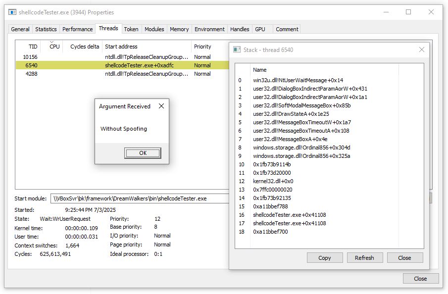
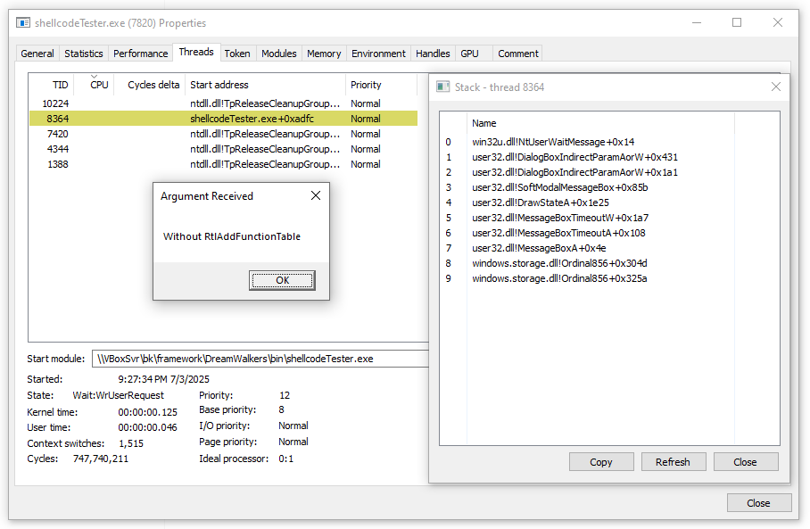

# DreamWalkers

> Reflective shellcode loader inspired by [MemoryModule](https://github.com/fancycode/MemoryModule) and [Donut](https://github.com/TheWover/donut), with advanced call stack spoofing and .NET support.

Check the blog post that is related: [DreamWalkers](https://maxdcb.github.io/DreamWalkers/)

Unlike traditional call stack spoofing, which often fails within reflectively loaded modules due to missing unwind metadata, DreamWalkers introduces a novel approach that enables clean and believable call stacks even during execution of shellcode-mapped payloads. By manually parsing the PE structure and registering custom unwind information via RtlAddFunctionTable, our loader restores proper stack unwinding — a capability that I didn't see achieved in reflective loading contexts. This allows our shellcode to blend in more effectively, even under the scrutiny of modern EDR and debugging tools.






---

## 🌘 Introduction

DreamWalkers is a research-grade project that blends ideas from Donut and MemoryModule to create a fully position-independent, reflective PE loader capable of clean call stack spoofing and modular payload execution — including .NET assemblies.

My goal was to understand how these components work under the hood, then reimplement and extend them with novel functionality. This includes position independence, command-line argument handling, .NET hosting using C++, and spoofed call stacks even in reflectively loaded code.

Big thanks to [@almounah](https://github.com/almounah) for his early support (even if he fell into the Go trap), and credit due to the original authors of Donut, MemoryModule, and [Being-A-Good-CLR-Host](https://github.com/passthehashbrowns/Being-A-Good-CLR-Host) as well as [SilentMoonwalk](https://github.com/klezVirus/SilentMoonwalk), LoudSunRun and others.

---

## 📦 Features

- 🧬 Position-independent shellcode extracted from a modified `MemoryModule`
- 🛠️ Shellcode generator inspired by Donut's stub generation
- 📝 Custom command-line argument handling for EXEs
- ☁️ .NET loader via intermediate native DLL (.NET logic not directly embedded in shellcode)
- 🎭 Clean and spoofed call stacks, even in reflectively loaded modules
- 🔥 Module stomping + unwind info registration using `RtlAddFunctionTable`

---

## 📁 Project Structure

```
/DreamWalkers
├── bin/                   # Output folder for compiled binaries and shellcode
├── common/                # Shared code or headers
├── compile.bat            # Windows batch script to compile components
├── dotnetLoader/          # C++ CLR host loader for .NET payloads
├── exe2h/                 # Tool for extracting TEXT section of binaries
├── finalShellcode.bin     # Final compiled shellcode output
├── GenerateShellcode.py   # Python script to generate shellcode and input structure
├── memoryModule/          # Modified, position-independent MemoryModule loader
├── shellcodeTester/       # Shellcode testing utilities 
├── testDll/               # Sample DLL payloads for testing loader
├── testExe/               # Sample EXE payloads for testing loader

```

---

## 🚀 How to Use

The project includes a Python script, `GenerateShellcode.py`, that bundles your payload (EXE or DLL) together with the position-independent loader, builds the required structure, and outputs a standalone shellcode blob.

### 📦 Basic Usage

```powershell
PS B:\framework\DreamWalkers> python .\GenerateShellcode.py -f .\Rubeus.exe -c help
````

* `-f`: Path to the payload (EXE or DLL)
* `-c`: Command-line arguments passed to the loaded module
* `-m`: (Optional) Method name to call if the payload is a DLL

### 🧠 Example Output

```text
File is a .NET (managed) executable.
Command line argument:  help
padding_length  11
Extracted 4954 bytes.
Instance struct size: 3552 bytes
Loader size: 4954 bytes
final shellcode  591173  bytes
```

The output `finalShellcode.bin` is a standalone, reflectively loadable shellcode. To test it you can use the very simple shellcodeTester.exe provided or use any shellcode injector.

### 📘 Help Menu

```powershell
PS B:\framework\DreamWalkers> python .\GenerateShellcode.py
usage: GenerateShellcode.py [-h] -f FILE [-m METHOD] [-c CMD] [-x {1,2,3}]

Generate shellcode from any given PE.

options:
  -h, --help           show this help message and exit
  -f, --file FILE      PE file path (DLL or EXE)
  -m, --method METHOD  Method name to invoke in case of DLL
  -c, --cmd CMD        Command line arguments
  -x, --exit {1,2,3}   Exit behavior: 1=exit thread, 2=exit process, 3=block indefinitely
```

Make sure to build the shellcode after any changes to the loader or input structure.

---

## 🚀 How to Build

From "x64 Native Tools Command Prompt for VS 2022":

```
.\compile.bat 
```

---

## 🧠 Credits

- [TheWover](https://github.com/TheWover) [modexp/odzhan](https://modexp.wordpress.com/) – Donut
- [fancycode](https://github.com/fancycode) – MemoryModule
- [passthehashbrowns](https://github.com/passthehashbrowns) – Being-A-Good-CLR-Host
- ChatGPT – For helping with stack unwinding research

---


